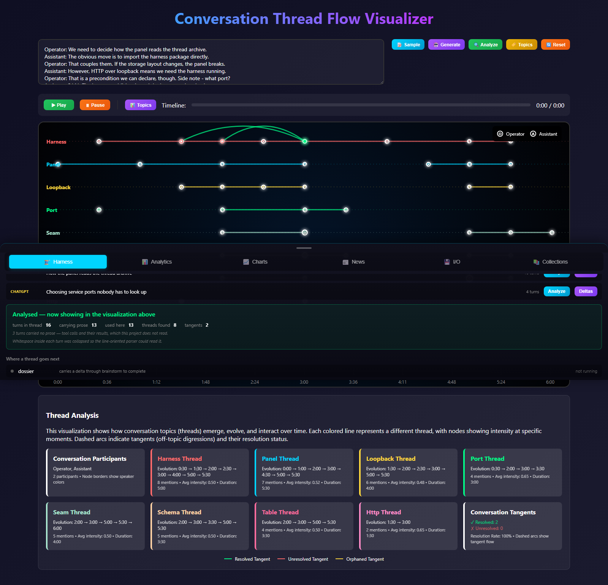
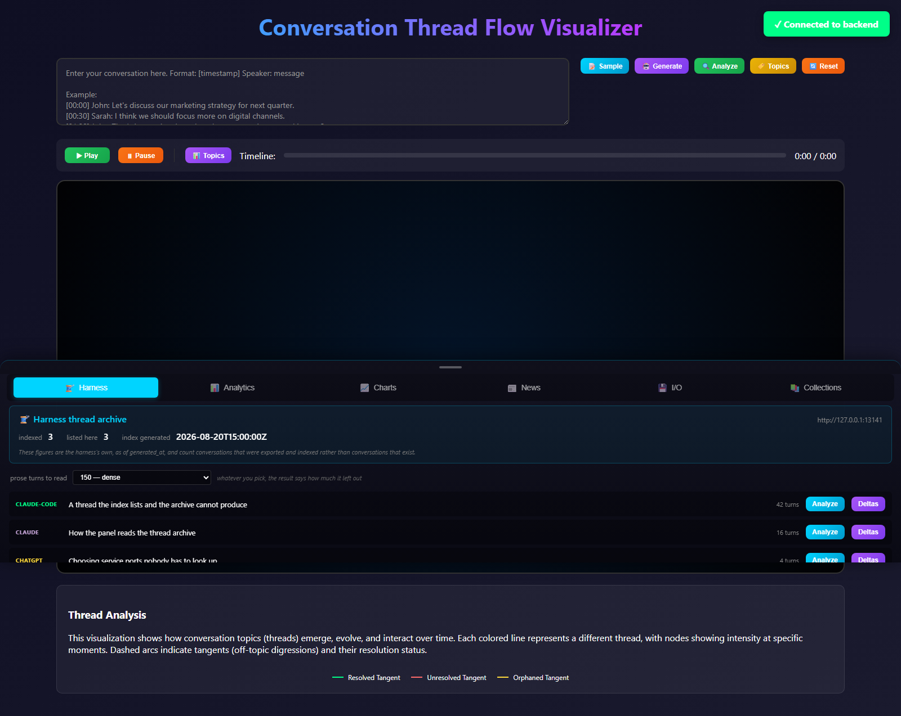
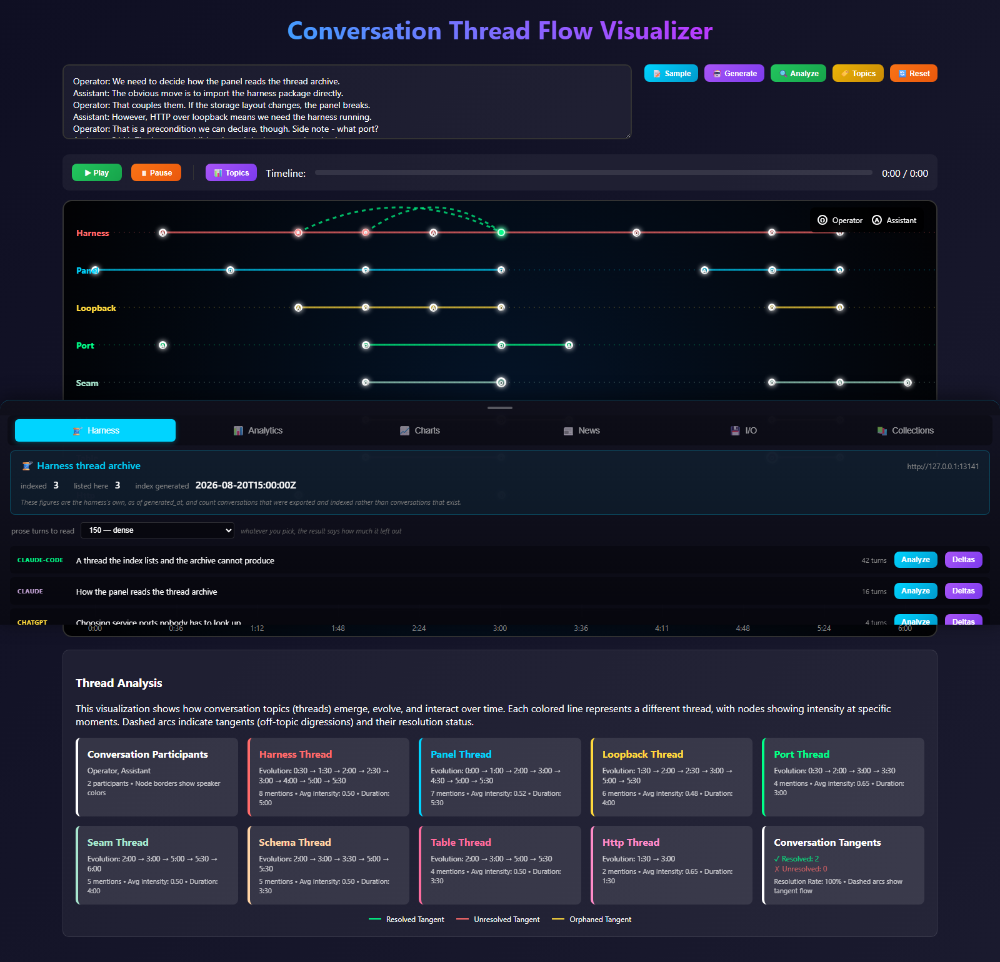

# looksatwords

Read natural language and say what was in it: who spoke, which topics were live
and when, where a conversation went off, and whether it came back.




## What it reads

**A conversation archive, not a paste box.** If [qmcp][qmcp] is serving on this
machine, looksatwords lists what it has indexed and analyses a thread in place.
Nothing is imported: what crosses is HTTP on loopback and a schema, and this
project never writes to the archive.



qmcp names the handful of decisions a thread settled. This reads the turns
underneath them — the ninety-seven that were not decisions — and reports the
topics they carried.

It also takes a transcript typed into the box, or gathered news, or text an LLM
generated. Both routes reach the same analysis and land in the same list.

## Quick start

```bash
git clone https://github.com/quaternionmedia/looksatwords.git
cd looksatwords
uv sync
uv run looksatwords serve
```

<http://localhost:8000>, API docs at `/docs`.

Generation needs a local [Ollama][ollama]. **The host is loopback and is not a
setting; the model is** — `LOOKSATWORDS_OLLAMA_MODEL`, default `llama3.1`.
`LOOKSATWORDS_DB` moves the database, which is what anything demonstrating the
tool should use.

## What it says when it cannot answer

An empty table and a broken one look identical, so this project does not draw
one for the other. When the archive is unreachable it says so and names the
command that fixes it; when the archive answers and disagrees with its own
index, it says that instead, and says the repair is not on this side.



Every conversion reports what it cost — how long the thread is, how much of it
is prose, and how much was read. Most turns in an assistant archive are tool
calls carrying no text, and a count that ignored them would describe an excerpt
as the conversation.

## Documentation

| Guide | Description |
|-------|-------------|
| [Getting Started](docs/getting-started.md) | Installation and first steps |
| [CLI Reference](docs/cli.md) | All available commands |
| [API Reference](docs/api.md) | REST API endpoints |
| [Open Questions](docs/open-questions.md) | What is waiting on a person, and what is not settled |
| [Contributing](docs/contributing.md) | Development guide |
| [Testing](docs/testing.md) | Running and writing tests |

## Governance

This project adopts the Quaternion Media constitution, vendored at
`governance/qm` and pinned to its own `project/looksatwords` branch. Read
[AGENTS.md](AGENTS.md) before your first commit. Its adoption record names the
border with `codecartographer`: **that project reads source code and this one
reads prose**, and the corpus each takes as input is the whole distinction.

## Tests

```bash
uv run pytest -m "not e2e"       # the default suite
uv run looksatwords screenshots  # re-record the pictures above
```

**The pictures in this README are recorded, not captured.**
`uv run looksatwords screenshots` starts the app against a stub harness and a
scratch database, drives a real browser, and writes them — after asserting the
page had something in it. Run it when the UI changes and commit what moves.

## License

MIT — see [LICENSE](LICENSE).

[qmcp]: https://github.com/quaternionmedia/qmcp
[ollama]: https://ollama.com
