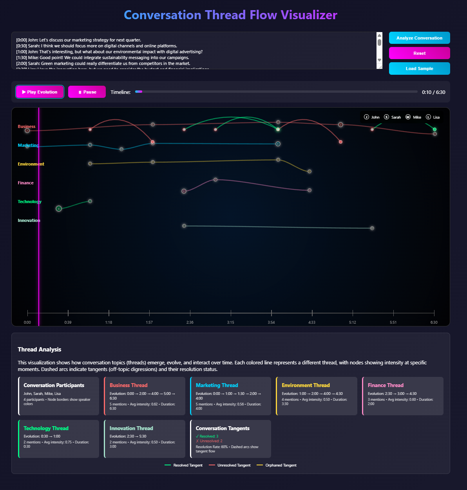

# looksatwords

Gather, generate, analyze, and visualize language data.




## Quick Start

```bash
# Install
git clone https://github.com/quaternionmedia/looksatwords.git
cd looksatwords
uv sync

# Run
uv run looksatwords serve
```

Visit http://localhost:8000 to analyze conversations.

## Features

- **Gather** - Collect news articles from GNews API or other sources
- **Generate** - Create synthetic conversations/articles using LLMs (Ollama)
- **Analyze** - Sentiment analysis, word frequencies, parts of speech with NLTK
- **Visualize** - Interactive conversation thread flow visualizations
- **Analytics** - Real-time analytics panel with sentiment timeline
- **Topics** - Dynamic topic extraction using NLP (TF-IDF, NER, noun phrases)
- **Collections** - Group conversations for corpus-level analysis and comparison
- **Charts** - Word clouds, sentiment plots, speaker comparisons, POS distribution
- **News** - Gather real news or generate synthetic articles with analytics
- **Import/Export** - Backup and restore conversation databases

## Documentation

| Guide | Description |
|-------|-------------|
| [Getting Started](docs/getting-started.md) | Installation and first steps |
| [CLI Reference](docs/cli.md) | All available commands |
| [API Reference](docs/api.md) | REST API endpoints |
| [Contributing](docs/contributing.md) | Development guide |
| [Testing](docs/testing.md) | Running and writing tests |

## Usage

### Web Interface

```bash
uv run looksatwords serve
```

### CLI Pipeline

```bash
uv run looksatwords run -i conversation.txt
```

### Python API

```python
from looksatwords.orchestrator import Orchestrator
from looksatwords.gatherer import GnewsGatherer

o = Orchestrator([GnewsGatherer()])
o.gather()
o.analyze()
o.visualize()
```

## Project Structure

```
looksatwords/
├── looksatwords/       # Main package
│   ├── app/            # FastAPI backend
│   ├── frontend/       # Web UI
│   └── tests/          # Test suite
├── docs/               # Documentation
└── output/             # Generated files
```

## Contributing

See [Contributing Guide](docs/contributing.md) for development setup.

```bash
uv run pytest           # Run tests
uv run ruff check       # Check code
```

## License

MIT License - see [LICENSE](LICENSE) for details
